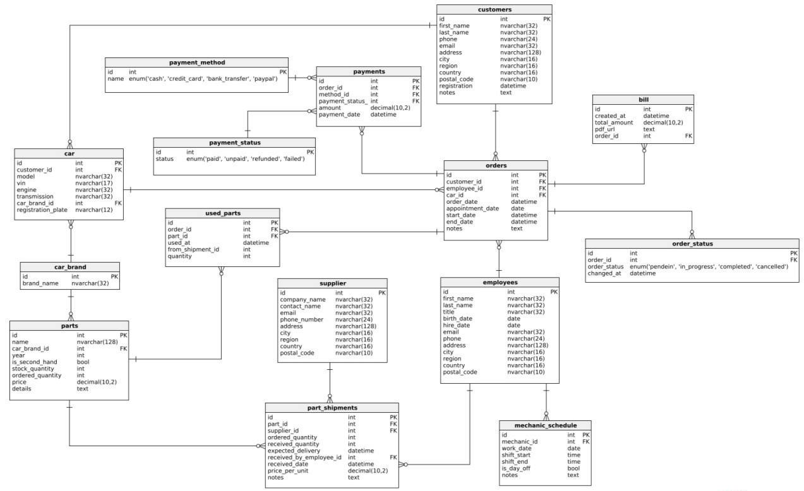

**Topic:** Car Workshop Management System

**Authors:** Vladyslav Humeniuk

**Description of each person's contribution to the current work:**
Vladyslav Humeniuk – #1 Scope and brief description of the system, #2 System requirements and functionalities, #3 Diagram and description of individual tables, #4 Implementation (DLL)


---

# 1. Scope and brief description of the system

The goal of the project is to create an IT system that supports the management of a car repair workshop. The system enables customer service, repair registration, staff and spare parts management, invoicing, and tracking of vehicle repair history. The main users of the system are mechanics, customers, administrators, and service managers.

The system allows, among other things:

- receiving service requests,
- scheduling repairs and assigning tasks to mechanics,
- monitoring spare parts availability,
- handling invoices and payments,
- managing employee schedules,
- tracking repair progress and generating reports.

# 2. System requirements and functionalities

### Mechanic (Must Have):

- Can view assigned repairs and their details.
- Can update repair status.
- Can check availability of parts and request needed components.
- Can add comments to repairs.
- Has access to their work schedule.

### Mechanic (Nice to Have):

- Can define their own specializations.
- Can mark days off.
- Has access to salary history.
- Can reject repair tasks with justification.

### Customer (Must Have):

- Can register an account and add vehicles.
- Can submit service requests.
- Has access to repair history.
- Can check the status of repairs.
- Can view and pay invoices.

### Customer (Nice to Have):

- Can leave feedback.
- Can receive offers and reminders.
- Can reschedule repair appointments.
- Can choose a preferred mechanic.

### Administrator (Must Have):

- Can register customers and their vehicles.
- Can create service requests.
- Can generate invoices and view payment statuses.
- Can view the list of employees currently on shift.

### Administrator (Nice to Have):

- Has access to customer service history.
- Can add internal notes.
- The system can suggest optimal appointment times.

### Manager (Must Have):

- Can manage employee accounts.
- Can assign repair requests to mechanics.
- Has insight into work schedules and parts availability.
- Can generate operational and financial reports.

### Manager (Nice to Have):

- Can define days off and holidays.
- Can configure automatic notifications.
- Can manage the price list of services.

# 3.	Database Project



### Description of Individual Tables

### Table: bill – Invoice Data
| Attribute Name | Type          | Description                  |
| -------------- | ------------- | ---------------------------- |
| id             | INT           | Primary key                  |
| created_at    | DATETIME      | Invoice issue date           |
| total_amount  | DECIMAL(10,2) | Total amount                 |
| pdf_url       | TEXT          | Link to the PDF invoice file |
| order_id      | INT           | Order ID (FK)                |


### Table: car – Client Vehicle Data
| Attribute Name      | Type         | Description                  |
| ------------------- | ------------ | ---------------------------- |
| id                  | INT          | Primary key                  |
| customer_id        | INT          | Client ID (FK)               |
| model               | NVARCHAR(32) | Vehicle model                |
| vin                 | NVARCHAR(17) | VIN number (unique)          |
| engine              | NVARCHAR(32) | Engine type                  |
| transmission        | NVARCHAR(32) | Transmission type            |
| car_brand_id      | INT          | Vehicle brand ID (FK)        |
| registration_plate | NVARCHAR(12) | Registration number (unique) |


### Table: car_brand – Car Brands
| Attribute Name | Type         | Description |
| -------------- | ------------ | ----------- |
| id             | INT          | Primary key |
| brand_name    | NVARCHAR(32) | Brand name  |


### Table: customers – Client Data
| Attribute Name | Type          | Description           |
| -------------- | ------------- | --------------------- |
| id             | INT           | Primary key           |
| first_name    | NVARCHAR(32)  | First name            |
| last_name     | NVARCHAR(32)  | Last name             |
| phone          | NVARCHAR(24)  | Phone number (unique) |
| email          | NVARCHAR(32)  | E-mail (unique)       |
| address        | NVARCHAR(128) | Address               |
| city           | NVARCHAR(16)  | City                  |
| region         | NVARCHAR(16)  | Region                |
| country        | NVARCHAR(16)  | Country               |
| postal_code   | NVARCHAR(10)  | Postal code           |
| registration   | DATETIME      | Registration date     |
| notes          | TEXT          | Notes                 |


### Table: employees – Employee Data
| Attribute Name | Type          | Description           |
| -------------- | ------------- | --------------------- |
| id             | INT           | Primary key           |
| first_name    | NVARCHAR(32)  | First name            |
| last_name     | NVARCHAR(32)  | Last name             |
| title          | NVARCHAR(32)  | Position              |
| birth_date    | DATE          | Birth date            |
| hire_date     | DATE          | Hire date             |
| email          | NVARCHAR(32)  | E-mail (unique)       |
| phone          | NVARCHAR(24)  | Phone number (unique) |
| address        | NVARCHAR(128) | Address               |
| city           | NVARCHAR(16)  | City                  |
| region         | NVARCHAR(16)  | Region                |
| country        | NVARCHAR(16)  | Country               |
| postal_code   | NVARCHAR(10)  | Postal code           |


### Table: mechanic_schedule – Mechanics' Work Schedule
| Attribute Name | Type | Description                  |
| -------------- | ---- | ---------------------------- |
| id             | INT  | Primary key                  |
| mechanic_id   | INT  | Mechanic ID (FK → employees) |
| work_date     | DATE | Work date                    |
| shift_start   | TIME | Shift start                  |
| shift_end     | TIME | Shift end                    |
| is_day_off   | BOOL | Is day off                   |
| notes          | TEXT | Notes                        |


### Table: order_status – Order Status History
| Attribute Name | Type                                                      | Description        |
| -------------- | --------------------------------------------------------- | ------------------ |
| id             | INT                                                       | Primary key        |
| order_id      | INT                                                       | Order ID (FK)      |
| order_status  | ENUM('pendein', 'in_progress', 'completed', 'cancelled') | Order status       |
| changed_at    | DATETIME                                                  | Status change date |


### Table: orders – Service Orders
| Attribute Name    | Type     | Description        |
| ----------------- | -------- | ------------------ |
| id                | INT      | Primary key        |
| customer_id      | INT      | Client ID (FK)     |
| employee_id      | INT      | Employee ID (FK)   |
| car_id           | INT      | Vehicle ID (FK)    |
| order_date       | DATETIME | Order date         |
| appointment_date | DATE     | Appointment date   |
| start_date       | DATETIME | Start of execution |
| end_date         | DATETIME | End of execution   |
| notes             | TEXT     | Notes              |


### Table: part_shipments – Part Deliveries
| Attribute Name             | Type          | Description       |
| -------------------------- | ------------- | ----------------- |
| id                         | INT           | Primary key       |
| part_id                   | INT           | Part ID (FK)      |
| supplier_id               | INT           | Supplier ID (FK)  |
| ordered_quantity          | INT           | Ordered quantity  |
| received_quantity         | INT           | Received quantity |
| expected_delivery         | DATETIME      | Expected delivery |
| received_by_employee_id | INT           | Received by (FK)  |
| received_date             | DATETIME      | Receipt date      |
| price_per_unit           | DECIMAL(10,2) | Price per unit    |
| notes                      | TEXT          | Notes             |


### Table: parts – Auto Parts
| Attribute Name    | Type          | Description           |
| ----------------- | ------------- | --------------------- |
| id                | INT           | Primary key           |
| name              | NVARCHAR(128) | Part name             |
| car_brand_id    | INT           | Vehicle brand ID (FK) |
| year              | INT           | Year of manufacture   |
| is_second_hand  | BOOL          | Is second-hand        |
| stock_quantity   | INT           | Stock quantity        |
| ordered_quantity | INT           | Ordered quantity      |
| price             | DECIMAL(10,2) | Price                 |
| details           | TEXT          | Details               |


### Table: payment_method – Payment Methods
| Attribute Name | Type                                                     | Description    |
| -------------- | -------------------------------------------------------- | -------------- |
| id             | INT                                                      | Primary key    |
| name           | ENUM('cash', 'credit_card', 'bank_transfer', 'paypal') | Payment method |


### Table: payment_status – Payment Statuses
| Attribute Name | Type                                         | Description    |
| -------------- | -------------------------------------------- | -------------- |
| id             | INT                                          | Primary key    |
| status         | ENUM('paid', 'unpaid', 'refunded', 'failed') | Payment status |


### Table: payments – Order Payments
| Attribute Name      | Type          | Description            |
| ------------------- | ------------- | ---------------------- |
| id                  | INT           | Primary key            |
| order_id           | INT           | Order ID (FK)          |
| method_id          | INT           | Payment method ID (FK) |
| payment_status_id | INT           | Payment status ID (FK) |
| amount              | DECIMAL(10,2) | Amount                 |
| payment_date       | DATETIME      | Payment date           |


### Table: supplier – Part Suppliers
| Attribute Name | Type          | Description    |
| -------------- | ------------- | -------------- |
| id             | INT           | Primary key    |
| company_name  | NVARCHAR(32)  | Company name   |
| contact_name  | NVARCHAR(32)  | Contact person |
| email          | NVARCHAR(32)  | E-mail address |
| phone_number  | NVARCHAR(24)  | Phone number   |
| address        | NVARCHAR(128) | Address        |
| city           | NVARCHAR(16)  | City           |
| region         | NVARCHAR(16)  | Region         |
| country        | NVARCHAR(16)  | Country        |
| postal_code   | NVARCHAR(10)  | Postal code    |


### Table: used_parts – Parts Used in Orders
| Attribute Name     | Type     | Description      |
| ------------------ | -------- | ---------------- |
| id                 | INT      | Primary key      |
| order_id          | INT      | Order ID (FK)    |
| part_id           | INT      | Part ID (FK)     |
| used_at           | DATETIME | Date of use      |
| from_shipment_id | INT      | Shipment ID (FK) |
| quantity           | INT      | Quantity used    |


# 4. implementation

### Code DDL


### Table: bill
```
CREATE TABLE bill (
    id int  NOT NULL,
    created_at datetime  NOT NULL,
    total_amount decimal(10,2)  NOT NULL,
    pdf_url text  NOT NULL,
    order_id int  NOT NULL,
    CONSTRAINT bill_pk PRIMARY KEY (id)
);
```
### Table: car
```
CREATE TABLE car (
    id int  NOT NULL,
    customer_id int  NOT NULL,
    model nvarchar(32)  NOT NULL,
    vin nvarchar(17)  NOT NULL,
    engine nvarchar(32)  NOT NULL,
    transmission nvarchar(32)  NOT NULL,
    car_brand_id int  NOT NULL,
    registration_plate nvarchar(12)  NOT NULL,
    UNIQUE INDEX unique_vin (vin),
    UNIQUE INDEX unique_registration_plate (registration_plate),
    CONSTRAINT car_pk PRIMARY KEY (id)
);
```

### Table: car_brand
```
CREATE TABLE car_brand (
    id int  NOT NULL,
    brand_name nvarchar(32)  NOT NULL,
    CONSTRAINT car_brand_pk PRIMARY KEY (id)
);
```

### Table: customers
```
CREATE TABLE customers (
    id int  NOT NULL,
    first_name nvarchar(32)  NOT NULL,
    last_name nvarchar(32)  NOT NULL,
    phone nvarchar(24)  NOT NULL,
    email nvarchar(32)  NOT NULL,
    address nvarchar(128)  NOT NULL,
    city nvarchar(16)  NOT NULL,
    region nvarchar(16)  NOT NULL,
    country nvarchar(16)  NOT NULL,
    postal_code nvarchar(10)  NOT NULL,
    registration datetime  NOT NULL,
    notes text  NOT NULL,
    UNIQUE INDEX unique_email (email),
    UNIQUE INDEX unique_phone (phone),
    CONSTRAINT customers_pk PRIMARY KEY (id)
);
```

### Table: employees
```
CREATE TABLE employees (
    id int  NOT NULL,
    first_name nvarchar(32)  NOT NULL,
    last_name nvarchar(32)  NOT NULL,
    title nvarchar(32)  NOT NULL,
    birth_date date  NOT NULL,
    hire_date date  NOT NULL,
    email nvarchar(32)  NOT NULL,
    phone nvarchar(24)  NOT NULL,
    address nvarchar(128)  NOT NULL,
    city nvarchar(16)  NOT NULL,
    region nvarchar(16)  NOT NULL,
    country nvarchar(16)  NOT NULL,
    postal_code nvarchar(10)  NOT NULL,
    UNIQUE INDEX unique_email (email),
    UNIQUE INDEX unique_phone (phone),
    CONSTRAINT employees_pk PRIMARY KEY (id)
);
```

### Table: mechanic_schedule
```
CREATE TABLE mechanic_schedule (
    id int  NOT NULL,
    mechanic_id int  NOT NULL,
    work_date date  NOT NULL,
    shift_start time  NOT NULL,
    shift_end time  NOT NULL,
    is_day_off bool  NOT NULL,
    notes text  NOT NULL,
    CONSTRAINT mechanic_schedule_pk PRIMARY KEY (id)
);
```

### Table: order_status
```
CREATE TABLE order_status (
    id int  NOT NULL,
    order_id int  NOT NULL,
    order_status enum('pendein', 'in_progress', 'completed', 'cancelled')  NOT NULL,
    changed_at datetime  NOT NULL,
    CONSTRAINT order_status_pk PRIMARY KEY (id)
);
```

### Table: orders
```
CREATE TABLE orders (
    id int  NOT NULL,
    customer_id int  NOT NULL,
    employee_id int  NOT NULL,
    car_id int  NOT NULL,
    order_date datetime  NOT NULL,
    appointment_date date  NOT NULL,
    start_date datetime  NOT NULL,
    end_date datetime  NOT NULL,
    notes text  NOT NULL,
    CONSTRAINT orders_pk PRIMARY KEY (id)
);
```

### Table: part_shipments
```
CREATE TABLE part_shipments (
    id int  NOT NULL,
    part_id int  NOT NULL,
    supplier_id int  NOT NULL,
    ordered_quantity int  NOT NULL,
    received_quantity int  NOT NULL,
    expected_delivery datetime  NOT NULL,
    received_by_employee_id int  NOT NULL,
    received_date datetime  NOT NULL,
    price_per_unit decimal(10,2)  NOT NULL,
    notes text  NOT NULL,
    CONSTRAINT part_shipments_pk PRIMARY KEY (id)
);
```

### Table: parts
```
CREATE TABLE parts (
    id int  NOT NULL,
    name nvarchar(128)  NOT NULL,
    car_brand_id int  NOT NULL,
    year int  NOT NULL,
    is_second_hand bool  NOT NULL,
    stock_quantity int  NOT NULL,
    ordered_quantity int  NOT NULL,
    price decimal(10,2)  NOT NULL,
    details text  NOT NULL,
    CONSTRAINT parts_pk PRIMARY KEY (id)
);
```

### Table: payment_method
```
CREATE TABLE payment_method (
    id int  NOT NULL,
    name enum('cash', 'credit_card', 'bank_transfer', 'paypal')  NOT NULL,
    CONSTRAINT payment_method_status_pk PRIMARY KEY (id)
);
```

### Table: payment_status
```
CREATE TABLE payment_status (
    id int  NOT NULL,
    status enum('paid', 'unpaid', 'refunded', 'failed')  NOT NULL,
    CONSTRAINT payment_status_pk PRIMARY KEY (id)
);
```

### Table: payments
```
CREATE TABLE payments (
    id int  NOT NULL,
    order_id int  NOT NULL,
    method_id int  NOT NULL,
    payment_status_id int  NOT NULL,
    amount decimal(10,2)  NOT NULL,
    payment_date datetime  NOT NULL,
    CONSTRAINT payment_pk PRIMARY KEY (id)
);
```

### Table: supplier
```
CREATE TABLE supplier (
    id int  NOT NULL,
    company_name nvarchar(32)  NOT NULL,
    contact_name nvarchar(32)  NOT NULL,
    email nvarchar(32)  NOT NULL,
    phone_number nvarchar(24)  NOT NULL,
    address nvarchar(128)  NOT NULL,
    city nvarchar(16)  NOT NULL,
    region nvarchar(16)  NOT NULL,
    country nvarchar(16)  NOT NULL,
    postal_code nvarchar(10)  NOT NULL,
    CONSTRAINT supplier_pk PRIMARY KEY (id)
);
```

### Table: used_parts
```
CREATE TABLE used_parts (
    id int  NOT NULL,
    order_id int  NOT NULL,
    part_id int  NOT NULL,
    used_at datetime  NOT NULL,
    from_shipment_id int  NOT NULL,
    quantity int  NOT NULL,
    CONSTRAINT part_in_order_pk PRIMARY KEY (id)
);
```

## Foreign keys

### Reference: bill_orders (table: bill)
```
ALTER TABLE bill ADD CONSTRAINT bill_orders FOREIGN KEY bill_orders (order_id)
    REFERENCES orders (id);
```

### Reference: car_car_brand (table: car)
```
ALTER TABLE car ADD CONSTRAINT car_car_brand FOREIGN KEY car_car_brand (car_brand_id)
    REFERENCES car_brand (id);
```

### Reference: car_customers (table: car)
```
ALTER TABLE car ADD CONSTRAINT car_customers FOREIGN KEY car_customers (customer_id)
    REFERENCES customers (id);
```

### Reference: mechanic_schedule_employees (table: mechanic_schedule)
```
ALTER TABLE mechanic_schedule ADD CONSTRAINT mechanic_schedule_employees FOREIGN KEY mechanic_schedule_employees (mechanic_id)
    REFERENCES employees (id);
```

### Reference: order_status_orders (table: order_status)
```
ALTER TABLE order_status ADD CONSTRAINT order_status_orders FOREIGN KEY order_status_orders (order_id)
    REFERENCES orders (id);
```

### Reference: orders_car (table: orders)
```
ALTER TABLE orders ADD CONSTRAINT orders_car FOREIGN KEY orders_car (car_id)
    REFERENCES car (id);
```

### Reference: orders_customers (table: orders)
```
ALTER TABLE orders ADD CONSTRAINT orders_customers FOREIGN KEY orders_customers (customer_id)
    REFERENCES customers (id);
```

### Reference: orders_employees (table: orders)
```
ALTER TABLE orders ADD CONSTRAINT orders_employees FOREIGN KEY orders_employees (employee_id)
    REFERENCES employees (id);
```

### Reference: part_in_order_orders (table: used_parts)
```
ALTER TABLE used_parts ADD CONSTRAINT part_in_order_orders FOREIGN KEY part_in_order_orders (order_id)
    REFERENCES orders (id);
```

### Reference: part_in_order_parts (table: used_parts)
```
ALTER TABLE used_parts ADD CONSTRAINT part_in_order_parts FOREIGN KEY part_in_order_parts (part_id)
    REFERENCES parts (id);
```

### Reference: part_shipments_employees (table: part_shipments)
```
ALTER TABLE part_shipments ADD CONSTRAINT part_shipments_employees FOREIGN KEY part_shipments_employees (received_by_employee_id)
    REFERENCES employees (id);
```

### Reference: part_shipments_parts (table: part_shipments)
```
ALTER TABLE part_shipments ADD CONSTRAINT part_shipments_parts FOREIGN KEY part_shipments_parts (part_id)
    REFERENCES parts (id);
```

### Reference: part_shipments_supplier (table: part_shipments)
```
ALTER TABLE part_shipments ADD CONSTRAINT part_shipments_supplier FOREIGN KEY part_shipments_supplier (supplier_id)
    REFERENCES supplier (id);
```

### Reference: parts_car_brand (table: parts)
```
ALTER TABLE parts ADD CONSTRAINT parts_car_brand FOREIGN KEY parts_car_brand (car_brand_id)
    REFERENCES car_brand (id);
```

### Reference: payment_orders (table: payments)
```
ALTER TABLE payments ADD CONSTRAINT payment_orders FOREIGN KEY payment_orders (order_id)
    REFERENCES orders (id);
```

### Reference: payments_payment_method (table: payments)
```
ALTER TABLE payments ADD CONSTRAINT payments_payment_method FOREIGN KEY payments_payment_method (method_id)
    REFERENCES payment_method (id);
```

### Reference: payments_payment_status (table: payments)
```
ALTER TABLE payments ADD CONSTRAINT payments_payment_status FOREIGN KEY payments_payment_status (payment_status_id)
    REFERENCES payment_status (id);
```


